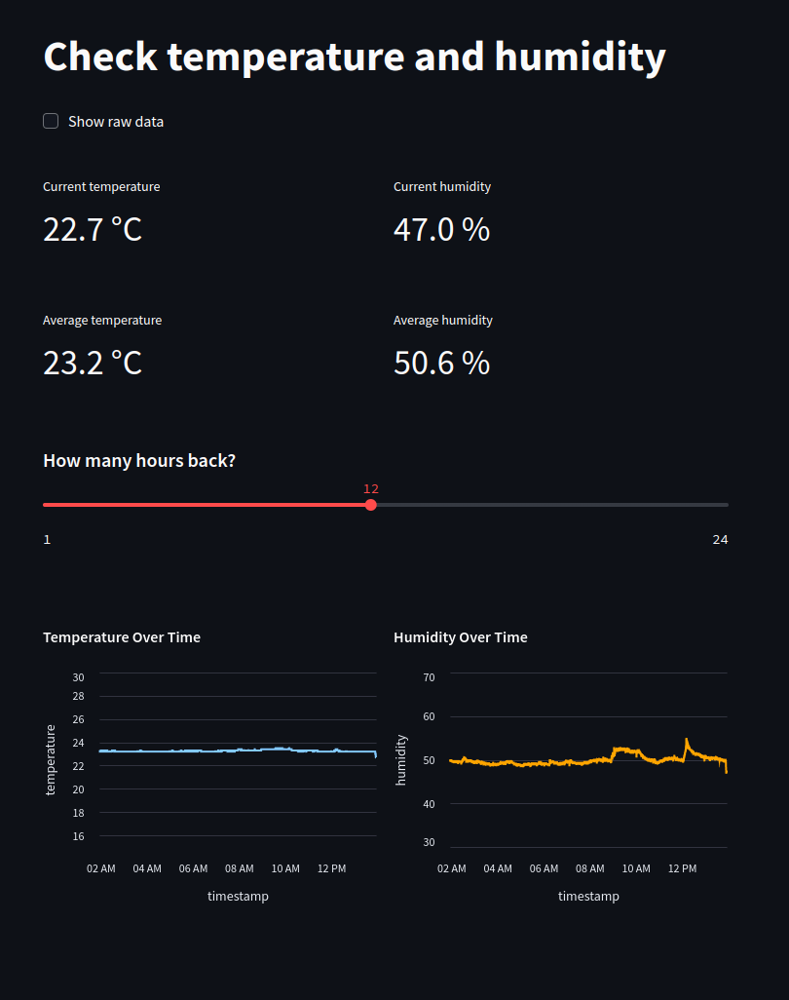
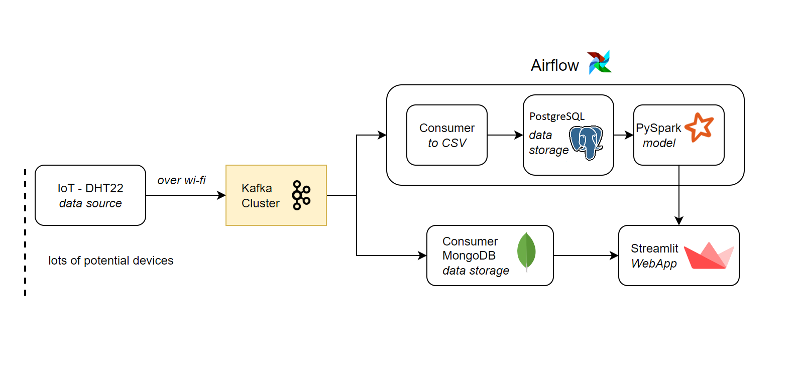

# Humidity Control
This project is focused on building a scalable IoT-based monitoring system for industrial environments, 
such as factories, to track temperature and humidity levels. The system leverages IoT devices to collect 
environmental data, which is then transmitted to a Streamlit web app and processed in real-time using Kafka. 
Apache Airflow orchestrates the data pipeline, automating the flow of data from ingestion to storage in Postgres. 
Designed for scalability and high reliability, this system is ideal for continuous monitoring and analysis of 
environmental conditions in industrial settings.

---




## Project schema




## Setup

Follow the steps below to set up and use the Humidity Control project.

---

### 1. Prerequisites
- **Python**: Ensure Python 3.9 or higher is installed. Download it from [python.org](https://www.python.org/).
- **Kafka**: Install and set up Kafka for real-time messaging.
- **MongoDB**: Set up MongoDB Cloud for noSQL storage.
- **PostgreSQL** Set up local Postgres for SQL storage.
- **Virtual Environment** (optional but recommended): Use `venv` to isolate project dependencies.
- **Airflow** Create Airflow scheduler and webserver
- **IoT** Create a device to measure temperature and humidity (following node_mcu folder)
- **Streamlit** Create Streamlit account

### 2. Clone the Repository
```bash
git clone https://github.com/pawel045/humidity-control.git
cd humidity-control
```


### 3. Requirements
Ensure you have Python 3.9 or higher installed. Install dependencies using the following command:

```bash
pip install -r requirements.txt
```

Inside ./pipeline/custom_func create **cred.py**

```python
# MongoDB Atlas Credentials
mdb_login = ""
mdb_password = ""
mdb_clust = ""
mdb_appname = ""
URI = f'mongodb+srv://{mdb_login}:{mdb_password}@{mdb_clust}.sm089.mongodb.net/?retryWrites=true&w=majority&appName={mdb_appname}'

# IP OF IOT DEVICE
PRIV_IP = ""

# PostgreSQL Credentials
PG_DBNAME = ""
PG_USER = ""
PG_PASSWORD = ""
PG_HOST = ""
PG_PORT = ""
PG_TABLENAME = ""
```


In Streamlit website set up credentials (for connecting with MongoDB)
```python
[mongodb]
cluster_name = ""
username = ""
password = ""
database = ""
```


## Folder Structure

```python
HumidityControl
├── node_mcu/                    # Contains Arduino code and connection schema
├── streamlit/app.py             # Streamlit web application
├── pipeline/                    # Custom pipelines and functions
│   ├── custom_func/
│   │   ├── cred.py              # Credentials for external services
│   │   ├── func.py              # Custom functions for project
│   │   ├── test_func.py         # Unit tests for custom functions
│   │   └── __init__.py          # Package initialization
├── requirements.txt             # Python dependencies
└── README.md                    # Project documentation
```


## Development direction

1. **Prediction models** Building temperature and humidity models based on data from Postgres
2. **Test** Finish writing unit tests for all functions
3. **Predictions in Streamlit** Based on models creating section with prediction in future  (PySpark part in diagram)

## License

MIT License
Copyright (c) 2024 Paweł Roszczyk
